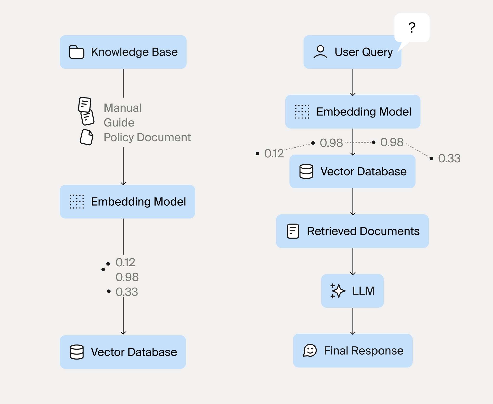

# Large-Language-Models
summary of learning from Tripleten Program

Large Language Models (LLMs) are the technology powering these interactions. They represent a fundamental shift in how we build AI systems that work with language.

## Supervised Fine-Tuning(SFT)
SFT teaches an LLM how to respond to your specific type of task.
Pretrained LLM = predicts next text
SFT / instruction tuning = teaches the model to follow instructions

| Step | What Happens | Practical Meaning |
|---|---|---|
| 1 | Pretraining | Model learns general language from huge text |
| 2 | Instruction dataset | Humans or AI create question-answer examples |
| 3 | SFT | Model trains on “instruction → good response” |
| 4 | Assistant behavior | Model learns to answer, summarize, explain, classify, code |

What we need to learn from this lesson:
1. SFT uses examples
2. Each example has an instruction and a desired answer
3. The model learns the style and task from those examples
4. Data quality is very important
5. SFT is different from RAG
   - SFT teaches behavior
   - RAG gives outside knowledge/documents

   RAG = Retrieval-Augmented Generation
Simple meaning:
RAG lets an LLM answer using your own documents instead of only its memory.
---
| Method | Meaning |
|---|---|
| SFT | Teaches the model how to behave or answer |
| RAG | Gives the model documents to use while answering |

**Learning from Human Feedback**
RLHF teaches an LLM which answer humans prefer when more than one answer is possible.

## RLHF Pipeline Summary

- RLHF stands for **Reinforcement Learning from Human Feedback**.
- It is used after supervised fine-tuning/instruction tuning.
- The goal is to make the LLM produce answers that humans prefer, not just answers that follow instructions.
- First, the model generates multiple responses to the same prompt.
- Humans compare the responses and choose the better one.
- These comparisons create a preference dataset.
- A reward model is trained to predict which responses humans would prefer.
- The LLM is then optimized to produce responses that receive higher reward scores.
- PPO, or Proximal Policy Optimization, is often used to update the model gradually.
- The main idea is to improve helpfulness, clarity, safety, and response quality.
SFT = teaches the model to answer instructions.
RLHF = teaches the model which answer humans prefer.
RAG = gives the model documents to use.

## LLM Landscape Summary

- LLMs can be accessed in two main ways: **proprietary API models** and **open-weight models**.
- Proprietary models, such as `OpenAI GPT, Claude, and Gemini`, are used through APIs. They are powerful and easy to use, but the model weights are not public.
- Open-weight models, such as `Llama` and `Mistral`, can be downloaded, self-hosted, customized, and fine-tuned.
- API models are usually easier for beginners because the provider manages the infrastructure.
- Open-weight models give more control, better privacy, and more customization, but they require more technical setup.
- Larger models are usually stronger for complex reasoning, but smaller models can be faster, cheaper, and useful for simple tasks.
- For practical projects, model choice depends on cost, speed, privacy, accuracy, and task complexity.
###  Controlling LLM Output with Generation Parameters
When we ask an LLM a question, it does not just “know one answer.” It predicts the next token step by step. These settings help you control whether the answer is stable, creative, short, long, repetitive, or precise.

*main Idea*
    Prompt = what We ask
    Generation parameters = how the model answers

| Parameter | Simple Meaning | When To Use |
|---|---|---|
| `temperature` | Controls randomness/creativity | Low for factual answers, higher for brainstorming |
| `top_p` | Controls how many likely words the model can choose from | Usually keep around `0.9` |
| `top_k` | Limits choices to top k tokens | Often disabled; less important than top_p |
| `max_tokens` | Maximum response length | Use to keep answers short or control cost |
| `frequency_penalty` | Reduces repeated words | Use if model repeats too much |
| `presence_penalty` | Encourages new ideas/topics | Use for brainstorming |
| `stop sequence` | Tells model where to stop | Use for structured output |

`Best Settings To Remember`
*For factual learning, coding, MOF explanation, README notes:*

* temperature = 0.2
* top_p = 0.9
* max_tokens = 300

*For brainstorming project ideas:*
* temperature = 0.8
* top_p = 0.95
* max_tokens = 500

*For very consistent output/testing:*

* temperature = 0

### Nebius Token Factory
Nebius Token Factory is your all-in-one platform for working with large language models (LLMs) — from quick experimentation to production deployment. Test and compare models in an intuitive playground, or integrate them into your applications via an OpenAI-compatible API for inference and fine-tuning, and extend capabilities through seamless integrations with popular frameworks.
#  Retrieval-Augmented Generation (RAG) 

The Illusion of Omniscience: The main problem with LLM creates illusion about knowing everything.every single detail is completely fabricated.
###  Three Fundamental Limitations
- Limitation 1: The Knowledge Cutoff
LLMs learn from training data collected at a specific point in time. Everything after that date is invisible to them.
- Limitation 2: Hallucination
When LLMs do not know something, they often do not admit it. Instead, they generate plausible-sounding but entirely fictional content. Researchers call this hallucination.
- Limitation 3: No Access to Private Data

| Limitation | Business Impact |
|---|---|
| Knowledge cutoff | Cannot answer questions about recent events, decisions, or changes |
| Hallucination | Users receive false information presented with false confidence |
| No private data access | Cannot help with organization-specific questions |

# Introducing RAG: Retrieval-Augmented Generation
Retrieval-Augmented Generation (RAG) solves these problems with an elegant insight: instead of making the LLM store all knowledge internally, give it the ability to look up information when needed

`RAG works in three steps:`

- Step 1: Retrieve relevant information from an external knowledge source based on the user's question

- Step 2: Augment the prompt by adding this retrieved information as context

- Step 3: Generate a response using both the LLM's capabilities and the retrieved information

`The Components of a RAG System`
* Building a RAG system requires several components working together:

* Knowledge Base: The collection of documents, articles, records, or other information you want the LLM to access. This could be company documentation, product manuals, research papers, or any text-based content.

* Embedding Model: Converts text into numerical vectors that capture semantic meaning. These vectors enable searching by meaning rather than just keyword matching.

* Vector Database: Stores the embedded vectors and enables fast similarity search. When a query comes in, the vector database finds documents with similar meaning.

* Retrieval System: Orchestrates the process of taking a query, searching the vector database, and returning relevant documents.

LLM: Generates the final response using the retrieved context and its own capabilities.

**Hugging Face Hub:** A repository hosting over 500,000 models and 100,000 datasets. Anyone can upload models, and anyone can download and use them.  Models from OpenAI, Google, Meta, Microsoft, and thousands of independent researchers can be found there. 

**Transformers Library:** A Python library for loading and using models from the Hub. It provides a consistent interface across thousands of different model architectures.

Datasets Library: Tools for loading, processing, and sharing datasets.

**Additional Libraries:** Specialized tools like sentence-transformers (for embeddings), accelerate (for distributed training), and tokenizers (for fast tokenization).